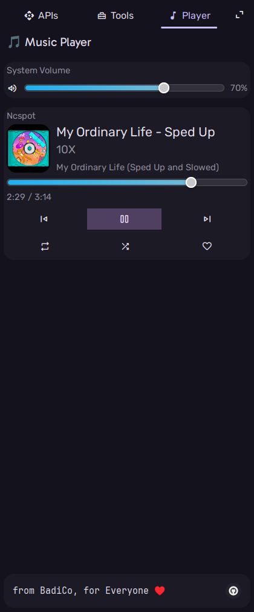
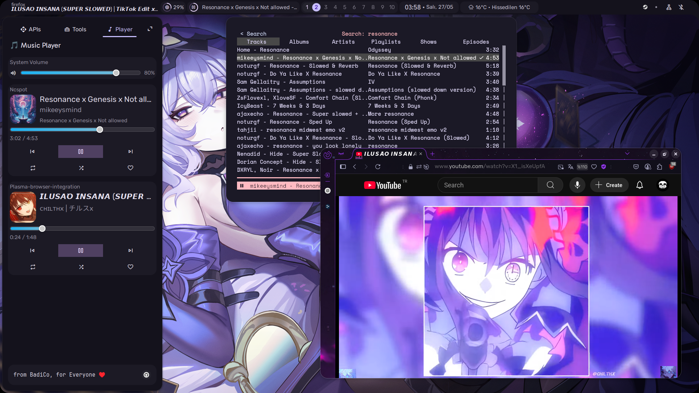

# dots-hyprland-player-sideleft-tab 🎵

A sleek and customizable music player widget for [Aylur's GTK Shell (AGS)](https://github.com/Aylur/ags), designed for Hyprland and other Wayland-based environments. This module allows you to monitor and control music playback from multiple sources — all within your AGS sidebar.

### ❗ **NOTE** 
> This configuration is tested only with the dots-hyprland setup.
> The install.py script is tailored for that specific structure — it won't magically adapt to other configs.
> However, feel free to modify and adapt it to your own environment if needed.


---

## ✨ Features

- 🎧 Displays currently playing track from multiple backends:
  - Firefox (via MPRIS)
  - Spotify
  - ncspot (Spotify TUI client)
  - Plasma browser integration
  - And more!
- ⏯ Playback controls: play, pause, skip
- 🔊 Volume and music timestamp control
- 💬 Metadata display: track title, artist, duration
- 🎨 Easy to customize and extend

---

## 📸 Screenshot

> The player integrates seamlessly into the sidebar layout:





---

## ⚙️ Requirements

- [dots-hyprland](https://github.com/end-4/dots-hyprland) dot files. (You can customize this code to your dots files if you want to!)
- AGS (Aylur's GTK Shell)
- Wayland compositor (Hyprland recommended)
- `playerctl` (for extended media control)
- Media players that support [MPRIS](https://specifications.freedesktop.org/mpris-spec/latest/)

---

## 🚀 Installation

```bash
git clone https://github.com/SlackerBahadir/dots-hyprland-player-sideleft-tab.git
cd dots-hyprland-player-sideleft-tab
./install.py
```

---

## ❓ Troubleshooting

### 1. Player tab works, but other tabs do not show up

**Cause:**  
The default tab modules (`apiwidgets.js` and `toolbox.js`) export plain objects instead of widget-returning functions. AGS expects modules to export *functions that return widgets*, not the widgets themselves.

**Solution:**  
You need to wrap your exports in arrow functions that return the widget. Here's how to fix it:

---

#### 🛠️ Fixing `toolbox.js`

**Replace this:**
```js
export default Scrollable({
    hscroll: "never",
    vscroll: "automatic",
    child: Box({
        vertical: true,
        className: 'spacing-v-10',
        children: [
            QuickScripts(),
            Conversions(),
            ColorPicker(),
            // ...Other widget elements you have
            Box({ vexpand: true }),
            Name(),
        ]
    })
});
````

**With this:**

```js
export default () => {
    return Widget.Scrollable({
        hscroll: 'never',
        vscroll: 'automatic',
        child: Widget.Box({
            vertical: true,
            children: [
                QuickScripts(),
                Conversions(),
                ColorPicker(),
                // ...Other widget elements you have
                Box({ vexpand: true }),
                Name(),
            ]
        })
    });
}
```

---

#### 🛠️ Fixing `apiwidgets.js`

**Replace this:**

```js
export default apiWidgets;
```

**With this:**

```js
export default () => {
    return Widget.Scrollable({
        hscroll: 'never',
        vscroll: 'automatic',
        child: Widget.Box({
            vertical: true,
            children: [
                apiWidgets,
                // ...Other widget elements you have
            ]
        })
    });
}
```

✅ Once you make these changes, the other tabs should render properly just like the Player tab.

---

## 🙌 Credits

This project builds upon the fantastic work in the [dots-hyprland](https://github.com/end-4/dots-hyprland) repo.
Special thanks to the AGS and Hyprland communities for making modular Linux UIs a joy to build.

---

## 🔧 Want to customize more?

Feel free to fork, tweak styles via SCSS, or even add new tabs with your own widgets. Contributions and ideas are welcome!

---

## 🧠 Final Thoughts

If you're building a modular and elegant AGS sidebar, this widget is a great starting point. With full control over the interface, it's your music — your way.

---

## 🐧 License
[MIT](LICENSE/)
